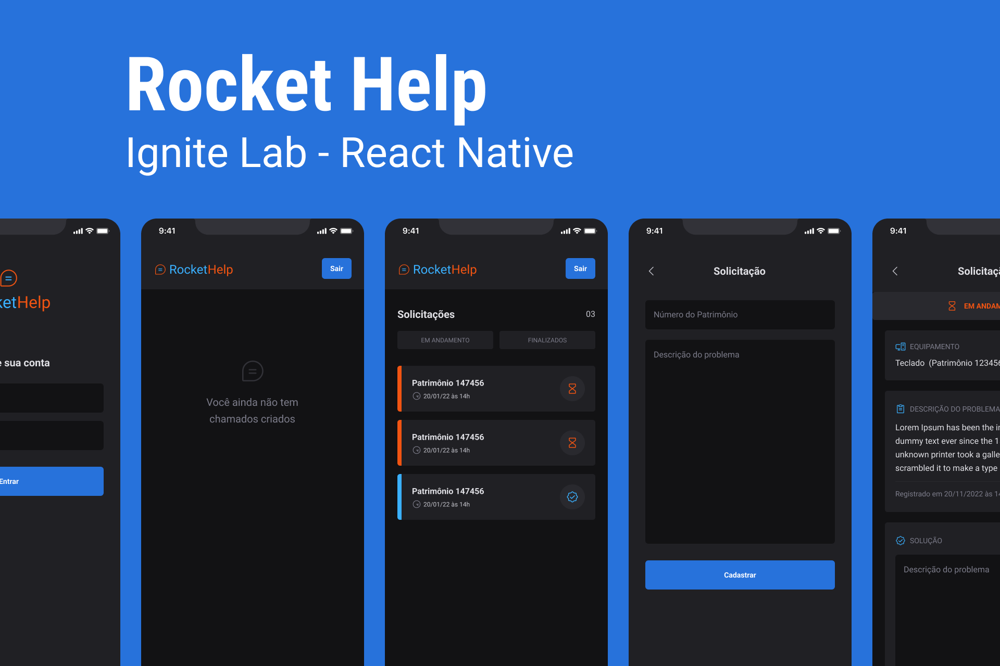

## Stack

<ul>
  <li>React Native</li>
  <li>Firebase: Google Auth and Firestore Database</li>
  <li>Phosphor-React-Native: Icons</li>
  <li>Base Native: UI</li>
  <li>Typescript</li>
  <li>Expo Bare Workflow</li>
</ul>

## Project

  Application for real-time management of maintenance requests and equipment support

## Functionalities

User authentication 
create new requests 
Filter requests by status 
Close request with solution 
Real-time database synchronization 
Among others..

  Project developed at the Rocketseat Ignite Lab React Native event Jul/2022

